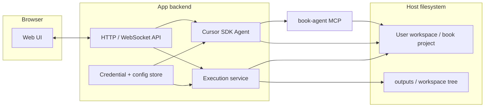

# PRD: Web app + Cursor SDK + artifact execution

| Field | Value |
|--------|--------|
| **Status** | Draft — build when time allows |
| **Phase** | Post–“book-agent in Cursor IDE” (MCP + rules); new surface: custom browser UI |
| **Owner** | (you) |
| **Related** | [USAGE.md](USAGE.md), [overview.md](overview.md), [design/MCP_SERVER.md](design/MCP_SERVER.md), [BOOK_AGENT_TOOLS.md](BOOK_AGENT_TOOLS.md), [Cursor TypeScript SDK](https://cursor.com/docs/api/sdk/typescript) |

---

## 1. Problem & context

Today, book-agent is used **inside Cursor**: MCP server, config/workspaces, rules for output paths. That works for developers who live in the IDE.

**Parallel track:** Users may adopt **other agent-centric products** (e.g. **Claude Code**, similar CLIs or hosts that expose MCP). The **book-agent MCP server** is the reusable core; investigation should confirm **stdio + env** wiring and whether **prompt/policy** equivalents exist outside Cursor (see §12.6).

**Gap:** A **browser-first** product can offer a simpler, guided UX (course flows, read-along, structured “sessions”) while still using the same **book tools** and a **strong agent** (Cursor-backed or equivalent).

**This PRD** defines a **first implementable phase**: prove a **web app** that (1) drives an agent via **Cursor SDK**, (2) stores user **credentials** safely in-app, and (3) **runs or opens** generated artifacts (notebooks, scripts, docs, code) via **OS processes** on a controlled host—not inside the browser alone.

---

## 2. Goals

1. **Web application** with a clear chat (and optionally file/workspace browser) that feels purpose-built for “work with my book project.”
2. **Agent loop** implemented with **`@cursor/sdk`** (TypeScript backend): create agent, send prompts, stream responses to the UI; support **multi-turn** sessions.
3. **User credentials** configurable in the app (e.g. **Cursor API key**, and any keys the agent needs: OpenRouter, Serper, etc. per your deployment policy)—**never** committed to repos; stored and injected server-side.
4. **book-agent integration**: agent can use **book-agent MCP** (or HTTP-wrapped equivalent later) with **`cwd` / `BOOK_AGENT_CONFIG`** aligned to the user’s project root, same semantics as [USAGE.md](USAGE.md).
5. **Artifact execution layer (optional per release):** v1 may **only** open paths, list files, and instruct the user to **run code in Cursor or a local shell**; full in-app execution is a stretch goal (see §6.4 and §12.4).
6. **Reading surface:** main pane supports **rendered Markdown (or HTML)** and a **PDF view** for faithful layout; **persistent sidebar chat** for multi-turn study; all generated files stay under **`_resolved_output_dir`** (server-enforced where possible).

## 3. Non-goals (this phase)

- Replacing Cursor IDE for power users; this is an **additional** channel.
- Full multi-tenant SaaS hardening (unless you explicitly scope it)—default assumption: **single-user** or **trusted small team**; add isolation later.
- Running arbitrary user code **in the browser** only (no Pyodide-only requirement; server/local execution is allowed).
- Pixel-perfect feature parity with Cursor (tabs, debugger, full LSP in browser).

---

## 4. High-level architecture

- **Browser:** UX only; no secrets in client bundles for production (keys via backend).
- **Backend:** Owns Cursor SDK, MCP subprocess env, and execution subprocesses.
- **Workspace:** Same mental model as today: `.book_agent.json`, `outputs/<workspace>/`, document paths.

---

## 5. Users & primary scenarios

| Scenario | Description |
|----------|-------------|
| **S1 — Study chat** | User opens web app, selects/creates project folder binding (or server-mounted workspace), chats with agent; agent calls **get_config**, **read**, **toc**, etc. |
| **S2 — Generate notebook** | Agent writes `.ipynb` under **`_resolved_output_dir`**; user clicks **Run notebook**; backend executes via Jupyter/`papermail`/nbconvert and streams cell outputs or logs. |
| **S3 — Generate code** | Agent writes `.py` / `.cpp`; user clicks **Run** or **Build**; backend runs compiler or interpreter with timeout and returns result. |
| **S4 — Credentials** | User pastes **Cursor API key** (and optional other keys) in **Settings**; backend stores encrypted at rest (see §8) and injects into SDK / env. |

---

## 6. Functional requirements

### 6.1 Web UI

- **FR-1** Chat view with message list and input; show **streaming** assistant output.
- **FR-2** **Settings** page: **Cursor API key** (password field), optional model id, optional paths for **workspace root** (or pre-provisioned mount id).
- **FR-3** Display **active workspace / document** summary when `get_config` succeeds (read-only mirror of key fields).
- **FR-4** List **recent artifacts** under resolved output dir (lightweight file tree or last-N files); deep polish optional in v1.

### 6.2 Cursor SDK integration

- **FR-5** Backend uses **`@cursor/sdk`** with **`Agent.create` + `agent.send` + stream** (multi-turn), or documented equivalent pattern from official docs.
- **FR-6** Configure **`local: { cwd }`** to user workspace root (or explicit cloud repos when/if you adopt cloud runtime—see SDK docs).
- **FR-7** Register **book-agent MCP** in agent options (stdio command + args + env including **`BOOK_AGENT_CONFIG`**), matching [USAGE.md](USAGE.md) global MCP semantics.
- **FR-8** Handle **`Agent.resume`** only if you need cross-session continuity; if used, **re-pass MCP config** on resume (SDK caveat).

### 6.3 Credentials & configuration

- **FR-9** **Secrets** entered in Settings stored server-side only; not echoed in logs; not exposed to browser except “set / unset” affordances.
- **FR-10** Inject **`CURSOR_API_KEY`** (or documented env name) for SDK; inject **`SERPER_API_KEY`**, **`OPENROUTER_API_KEY`**, etc., if book-agent tools need them—document which keys are required.
- **FR-11** Document **rotation**: user can replace key; old sessions invalidated or agent recreated.

### 6.4 Artifact execution & “open”

*v1 product may satisfy this subsection with **path discovery + preview + open-in-Cursor/terminal** only; headless notebook/script runs remain optional until explicitly scoped.*

- **FR-12** **Discovery**: After agent run, optionally scan **`_resolved_output_dir`** (from last `get_config` snapshot or `.book_agent.json` parse) for new/changed files.
- **FR-13** **Notebook**: Backend action **Execute notebook** — run headless pipeline (e.g. `jupyter execute`, `papermill`, or Jupyter Server API) with **timeout**, **working directory** = notebook dir or workspace root; return structured output (per-cell or aggregated log).
- **FR-14** **Notebook (interactive) optional**: **Open in Jupyter** — launch or link to JupyterLab URL if you run a sidecar Jupyter service (phase 1.5).
- **FR-15** **Python script**: Run with configured interpreter (`venv` path in settings optional); capture stdout/stderr/exit code.
- **FR-16** **C/C++ (optional v1)**: Compile to temp/build dir under workspace output; surface compiler errors; run binary if safe and scoped.
- **FR-17** **Markdown**: Render in-app preview; optional “open externally” if desktop companion exists later.
- **FR-18** **Safety**: All execution requests are **user-initiated** (button) or **explicitly confirmed** policy—no silent arbitrary exec from model without guardrails (configurable).

---

## 7. Non-functional requirements

- **NFR-1 Security:** Secrets at rest encrypted (KMS or libsodium/OS keychain pattern); TLS in transit; minimal logging.
- **NFR-2 Isolation:** Prefer **subprocess + separate uid/container** for execution when moving beyond single trusted user.
- **NFR-3 Limits:** Timeouts, max output bytes, max concurrent runs.
- **NFR-4 Observability:** Request ids, structured errors for UI (“MCP failed”, “notebook timeout”).
- **NFR-5 Compatibility:** Document Node version, Cursor SDK version pin, book-agent install (`pip install book-agent[mcp]` on execution host).

---

## 8. Credential handling (recommended practice)

| Secret | Use |
|--------|-----|
| Cursor API key | `@cursor/sdk` authentication |
| Serper / OpenRouter / Jina / etc. | Passed as **env** to MCP subprocess only |

**Do not** send Cursor API key to the browser in production builds. Use server-side session + HTTPS.

---

## 9. Milestones (suggested)

| Milestone | Deliverable |
|-----------|-------------|
| **M0 — Spike** | Minimal Express/Fastify app: one chat round-trip via SDK, stream to page; hardcoded `cwd` + MCP. |
| **M1 — Settings + persistence** | Settings UI; encrypted secret store; configurable workspace path. |
| **M2 — book-agent parity path** | `get_config` → chat shows resolved dirs; agent writes under output tree per policy (enforce server-side path checks optional). |
| **M3 — Execution v1** | Notebook headless execute + Python run + Markdown preview. |
| **M4 — Hardening** | Timeouts, quotas, optional Docker-backed runner. |

---

## 10. Risks & mitigations

| Risk | Mitigation |
|------|------------|
| SDK / MCP drift | Pin versions; smoke test `get_config` + `toc` on CI. |
| Arbitrary code execution | User-triggered runs only; sandbox in M4. |
| Jupyter env mismatch | Document base image / `requirements.txt` for execution environment. |
| Multi-user key leakage | Separate secret namespaces per tenant before going SaaS-wide. |

---

## 11. Open questions

1. **Deployment:** Single-user **localhost** companion vs **hosted** backend vs hybrid?
2. **Cloud SDK:** Will v1 use **only local** `cwd`, or **Cursor cloud** repos from day one?
3. **Auth:** Local-only login vs OAuth for hosted?
4. **Notebook UX:** Headless logs enough for v1, or mandatory JupyterLab embedding?
5. **Multi-host agents:** Which **non-Cursor** products are in scope first (Claude Code, CLI tools, IDE extensions), and is **parity** limited to MCP + pointers to policy docs or do we ship host-specific installers?

---

## 12. Reading surface, sync, formats & annotations (product direction)

### 12.1 Canonical model

- **Indexed sections** (same shape as today’s `index.json` / TOC: stable **section ids**, titles, ranges) are the **contract** between ingestion, chat context, and UI.
- **Views** (Markdown render, PDF viewer, later **sanitized HTML**) are **projections** of that model—not separate sources of truth.

### 12.2 PDF ↔ Markdown (or HTML) alignment

- **Primary place to solve this is ingest + indexing**, not the client alone: emit **section ↔ PDF page span** (or block-level hints) when the converter provides it; post-process with **text overlap** against per-page PDF text for **selectable-text** PDFs when page metadata is missing or noisy.
- **Scanned / image PDFs:** expect weaker coupling unless OCR + layout adds structure; UI should label sync as **approximate** when confidence is low.
- **Client behavior:** jump/scroll by **lookup** from the index and sidecar sync metadata; optional lightweight fallback heuristics only.

### 12.3 HTML without Markdown files (later)

- **Out of v1**, but low coupling if the indexer ingests **HTML headings** into the same section tree; render path becomes “HTML mode” instead of “MD mode.” Same chat and artifact rules apply.

### 12.4 Highlights & comments (later)

- Store in **sidecar storage** (e.g. JSON or DB under the workspace output tree), **not** embedded in publisher PDF/MD unless explicitly exported.
- **Anchor** annotations to **`index` node id** plus optional **character offset** in normalized text, and optionally **PDF page + quads** for PDF-only highlights.
- **Re-ingest drift:** keep a **quote snippet** or fingerprint to re-pin anchors after a new PDF→MD run.

### 12.5 Execution handoff

- **Acceptable default:** user switches to **Cursor or terminal** to run notebooks/scripts; the app surfaces **paths**, **“open folder”**, and suggested commands.
- **Optional later:** headless notebook/script execution as already sketched in §6.4 when security and ops warrant it.

### 12.6 Other platforms & agent products

- **Principle:** One **MCP server** + **`.book_agent.json`** semantics; hosts differ only in **how** the server is registered and whether **artifacts policy** can be conveyed (rules/skills/README prompts).
- **Investigate:** **[Claude Code](https://docs.anthropic.com/en/docs/claude-code/settings)** and similar hosts (VS Code MCP extensions, Claude Desktop, other CLIs)—**stdio** transport, **`cwd`** at project root, **`BOOK_AGENT_CONFIG`**—plus host **limitations** (tool limits, paths, sandboxing).
- **Deliverable (documentation):** short **compatibility checklist** or table in **`USAGE.md` / overview** (“Cursor: install-mcp; Other: paste this JSON snippet”) once validated—not a separate product unless justified.

---

## 13. Success criteria (phase complete)

- User can complete **S1** end-to-end with streaming.
- User can complete **S2** with at least **headless notebook execution** and visible results/errors.
- Credentials never appear in client source maps or git.
- Documented **runbook**: install backend deps, set keys, point workspace, start app.

---

## 14. References

- Cursor SDK skill / docs: `cursor-sdk` in Cursor skills; https://cursor.com/docs/api/sdk/typescript  
- Book-agent MCP: [design/MCP_SERVER.md](design/MCP_SERVER.md)  
- Workspace & outputs: [USAGE.md](USAGE.md), [design/CONFIG_AND_WORKSPACE.md](design/CONFIG_AND_WORKSPACE.md)  
- Docs map: [overview.md](overview.md)
